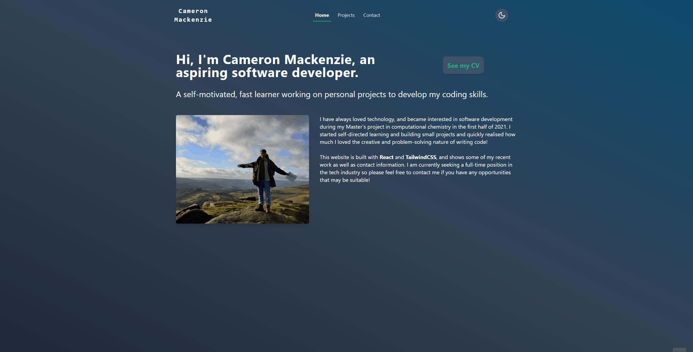
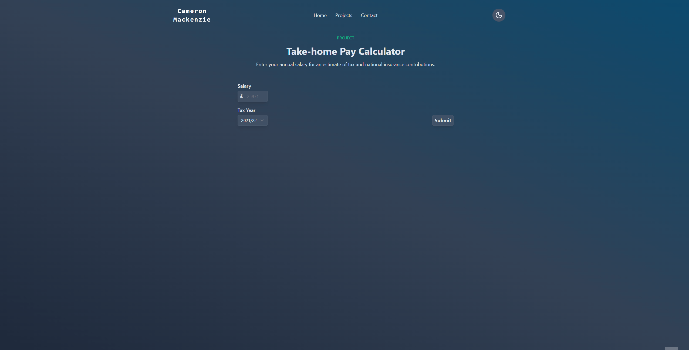

# Portfolio Website
My [website](https://www.cameronmackenzie.dev) is a place to collate my recent projects, during my self-taught journey into software and web development!

## Tech Stack

   \
Utilises netlify serverless functions to query calculator REST API hosted on AWS and to handle contact form submissions.

## Take-home Pay Calculator
Dynamic webpage for querying [take-home-pay-calculator](https://github.com/CameronMackenzie99/take-home-pay-calculator) API. Serverless function to render dynamic result without the need for backend server. Integration tests are written with [React Testing Library](https://testing-library.com/docs/react-testing-library/intro). [Try it out!](https://www.cameronmackenzie.dev/projects/take-home-pay-calculator)

## To Do
- [x] Create front-end for take-home pay calculator API
- [ ] Form input validation
- [x] Create home and project pages
- [x] Light/Dark mode
- [x] Deploy to live site
- [x] Implement contact form
- [ ] Write serverless CMS function for pulling blog posts from Notion
- [ ] Implement transitions for dynamically rendered elements

